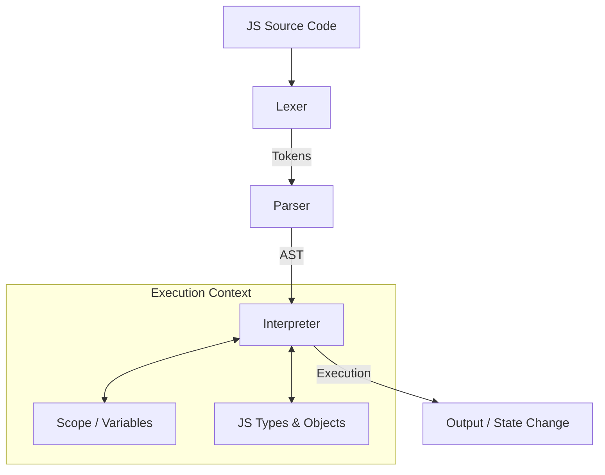

# Swiftly

Swiftly is a lightweight JavaScript interpreter written in Rust, designed with a focus on educational value and adherence to the ECMAScript specification.

## Architecture Overview

Swiftly follows a classic interpreter pipeline, transforming source code into executable actions through several distinct stages.



### Key Components

- **Lexer (`src/lexer.rs`)**: Performs lexical analysis, converting the raw string input into a sequence of `Token`s. It handles whitespaces, identifiers, literals (numbers, strings), and operators.
- **Parser (`src/parser.rs`)**: Consumes the token stream and builds an **Abstract Syntax Tree (AST)**. It implements recursive descent parsing to handle various JavaScript constructs like variable declarations, if-statements, while-loops, and complex expressions.
- **AST (`src/ast.rs`)**: Defines the data structures representing the JavaScript program. It consists of `Statement` and `Expression` enums that mirror the language's grammar.
- **Interpreter (`src/interpreter.rs`)**: The core execution engine. It traverses the AST and evaluates each node. It manages control flow (if/while) and delegates expression evaluation to the appropriate logic.
- **Environment (`src/environment.rs`)**: Manages variable scoping and name resolution. It supports nested scopes (e.g., blocks) via a parent-linkage system, allowing for proper variable shadowing and lexical scoping.
- **JS Types (`src/js_value.rs` & `src/js_object.rs`)**: 
    - `JsValue`: An enum representing primitive JavaScript types (Number, String, Boolean, Undefined, Null) and Objects.
    - `JsObject`: Implements JavaScript objects, including property descriptors and prototype-based inheritance.
- **Runtime (`src/runtime.rs`)**: The entry point that orchestrates the entire process from reading the source file to final execution.

## Getting Started

### Prerequisites

- [Rust](https://www.rust-lang.org/tools/install) (latest stable version recommended)

### Running a Program

By default, Swiftly runs the code located in `examples/example.js`.

```bash
cargo run
```

You can modify `examples/example.js` or change the source path in `src/main.rs` to run different JavaScript programs.

## Features (Current Implementation)

- [x] Variable Declarations (`let`)
- [x] Basic Types (Numbers, Strings, Booleans, Null, Undefined)
- [x] Arithmetic and Logical Operators
- [x] Control Flow (`if/else`, `while`)
- [x] Block Scoping
- [x] Basic Object Literals and Property Access
- [x] Prototype-based Inheritance (Initial implementation)

## Project Structure

```text
src/
├── ast.rs           # AST node definitions
├── environment.rs   # Scope and variable management
├── interpreter.rs   # AST evaluation logic
├── js_object.rs     # JS Object representation
├── js_value.rs      # JS Type system
├── lexer.rs         # Lexical analyzer
├── main.rs          # CLI entry point
├── parser.rs        # Syntactic analyzer
├── runtime.rs       # Orchestration layer
└── tokens.rs        # Token definitions
```
